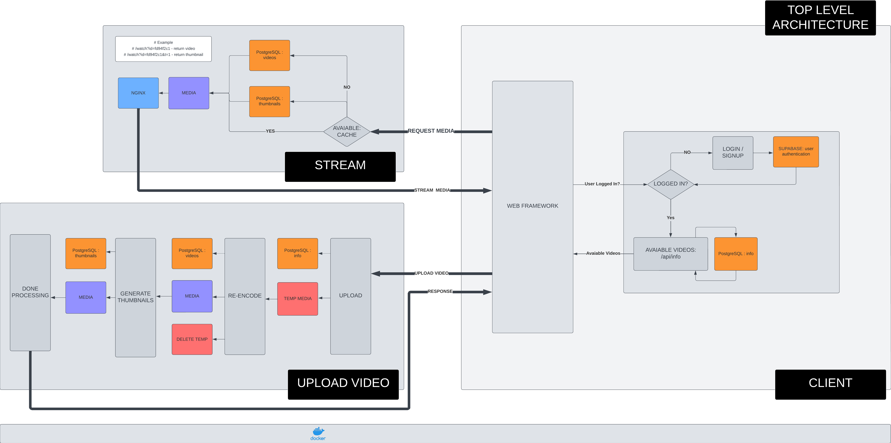

# Introduction 

[WatchVideoByLink](https://github.com/MohamedBakoush/WatchVideoByLink) was a great project, but at the time of creation, I (MohamedBakoush) using my shoestring of knowledge managed to build a standalone application loved/hated but 150+ GitHub users.

While WatchVideoByLink has many flaws, some more obvious than others, at the time of creation, I marvelled at it as my fine work, but as of now (7 Dec 2023), it haunts me. As it's an application that I like to use but hate to like, its sucks energy when downloading; the design is only optimal for desktop users with a bunch more features one can nitpick on.

PROCESS-VIDEO-XXX is a homage to WatchVideoByLink, aiming to improve my creation from scratch, developing something I can track and maintain until I die or lose interest.

## STILL PROTOTYPING ... THINGS MAY CHANGE

<kbd></kbd> 

CLIENT SERVER:
- UPLOAD VIDEO 
- SELECT UPLOADED VIDEO
- WATCH UPLOADED VIDEO
- CUSTOM VIDEO PLAYER
- PRISMA (CONNECT TO PSQL DATABASE)

STREAM SERVER:
- PYTHON FLASK PROXY 
- NGINX VIDEO/IMAGE MEDIA STREAM 

UPLOAD SERVER:
- DOWNLOAD UPLOADED VIDEO
- RE-ENCODE VIDEO + DELETE UPLOADED VIDEO
- GENERATE THUMBNAILS 

SUPABASE DATABASE: 
- USER AUTHENTICATION 

PSQL DATABASE:
- INFO
- VIDEOS
- THUMBNAILS